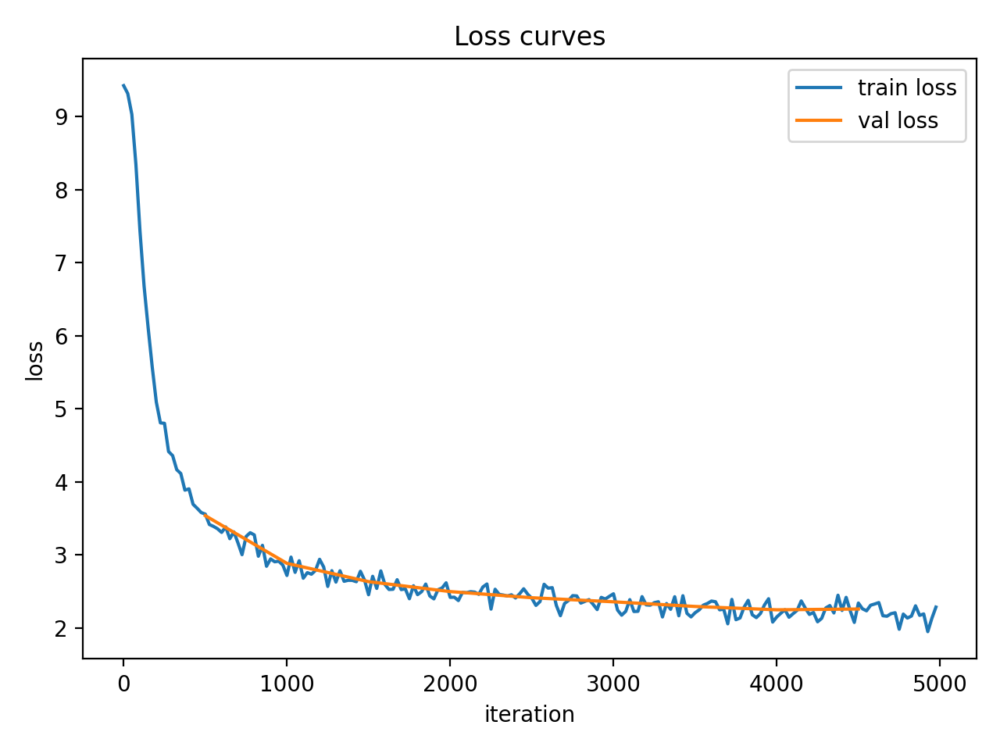
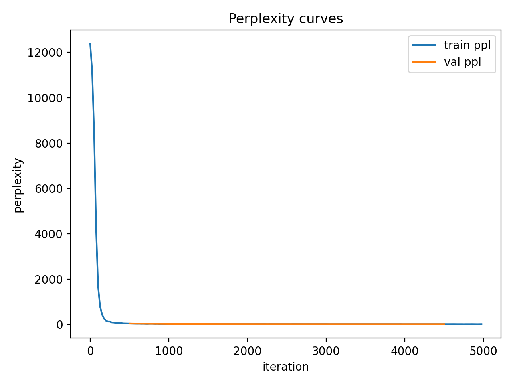

# Transformer LM: TinyStories Results & Implementation

A from-scratch implementation of a **decoder-only Transformer** with **Rotary Positional Embeddings (RoPE)**, trained on the **TinyStoriesV2-GPT4** dataset.

---

## 🚀 Performance Summary (TinyStories)

Trained for **5,000 steps** on an **Apple M2 GPU**. Even with a small model, it learns the simplified grammar and vocabulary of TinyStories effectively.

### Final Validation Metrics

| Metric | Value |
|---|---:|
| Validation Loss | **2.2370** |
| Validation Perplexity | **9.37** |

---

## 📉 Loss & Perplexity Curves

<p align="center">
  
  
</p>

<p align="center">
  <em><b>Left:</b> Combined Train/Val Loss curve. <b>Right:</b> Combined Train/Val Perplexity curve.</em>
</p>

---

## 🛠 Training Setup

- **Hardware:** Apple Silicon M2 (MacBook Pro)  
- **Backend:** PyTorch MPS (`--device mps`)  

### Architecture

- **Model Type:** Decoder-only Transformer + RoPE  
- **Parameters:** `d_model=256`, `num_layers=4`, `num_heads=8`, `d_ff=1024`  
- **Context:** `context_length=256`, `batch_size=16`, `rope_theta=10000.0`  

### Tokenizer

- **Tokenizer:** Custom BPE trained on TinyStories  
- **Vocab Size:** `10,000`

### Optimizer & Schedule

- **Optimizer:** AdamW + Cosine LR Decay  
- `lr=3e-4`, `min_lr=3e-5`, `warmup_iters=500`  
- `weight_decay=0.1`, `grad_clip=1.0`

---

## 🏃 Reproduce My Run

> Ensure you have **uv** installed. Steps: train tokenizer → encode data → train LM.

### 1) Train Tokenizer

```bash
uv run python scripts/train_tokenizer.py \
  --input data/TinyStoriesV2-GPT4-train.txt \
  --vocab-size 10000 \
  --out artifacts/tinystories_tokenizer \
  --special "<|endoftext|>"
```
### 2) Encode Dataset
```
# Encode Training Data
uv run python scripts/encode_dataset.py \
  --tok artifacts/tinystories_tokenizer \
  --input data/TinyStoriesV2-GPT4-train.txt \
  --output data/tinystories_train.uint32.bin


# Encode Validation Data
uv run python scripts/encode_dataset.py \
  --tok artifacts/tinystories_tokenizer \
  --input data/TinyStoriesV2-GPT4-valid.txt \
  --output data/tinystories_valid.uint32.bin
```
### 3) Train Language Model
```

uv run python main.py \
  --train_bin data/tinystories_train.uint32.bin \
  --valid_bin data/tinystories_valid.uint32.bin \
  --vocab_size 10000 \
  --context_length 256 \
  --batch_size 16 \
  --d_model 256 \
  --num_layers 4 \
  --num_heads 8 \
  --d_ff 1024 \
  --rope_theta 10000.0 \
  --lr 3e-4 \
  --min_lr 3e-5 \
  --warmup_iters 500 \
  --cosine_cycle_iters 5000 \
  --weight_decay 0.1 \
  --grad_clip 1.0 \
  --max_iters 5000 \
  --log_every 25 \
  --eval_every 1000 \
  --eval_iters 100 \
  --ckpt_path runs/tinystories_5k/checkpoint.pt \
  --device mps
```
###  Implementation Details

Core logic lives in cs336_basics/:

- **tokenizer.py, train_bpe.py** — Custom Byte Pair Encoding (BPE)
- **attention.py** — Scaled dot-product attention, multi-head attention, RoPE integration
- **transformer.py** — Transformer blocks + the TransformerLM class
- **optim.py** — AdamW optimizer, gradient clipping, cosine scheduler + warmup
- **data.py** — Efficient memmap-based batch sampling
- **serialization.py** — Save/resume checkpoints


###  Notes

- Large files are excluded via .gitignore:
- Dataset files (.txt)
- Tokenized binary streams (.bin)

