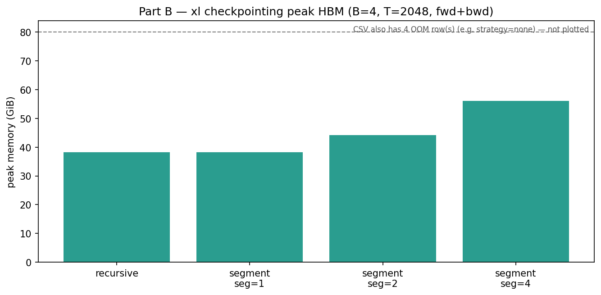

# Part B — activation checkpointing

**Raw data:** `checkpoint_latest.csv` (and dated copies).  
**Figures (for GitHub / writeup):** `figures/*.png`

## Peak memory (xl, B=4, T=2048, fwd+bwd)



`strategy=none` OOMs on this config (not shown as a bar). Segment checkpointing brings peak HBM down to the ~38 GiB range by recomputing activations instead of storing all of them.

## How to re-plot

```bash
uv run python -m cs336_systems.plot_results
```
