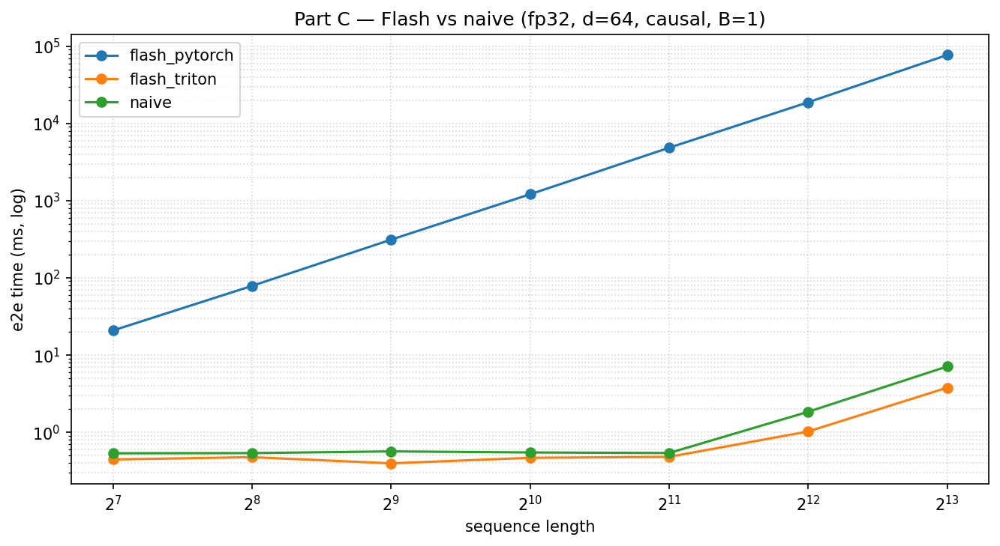
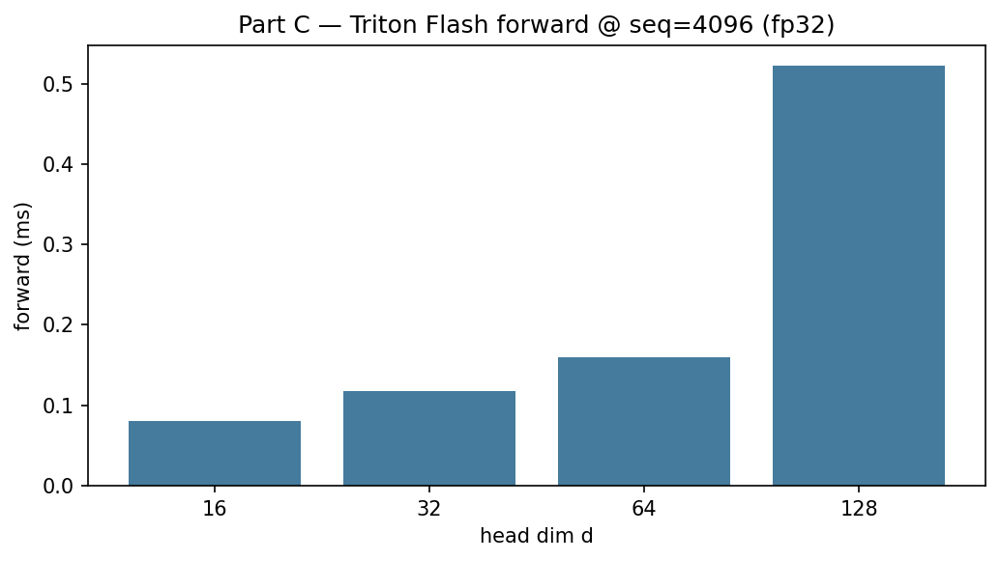
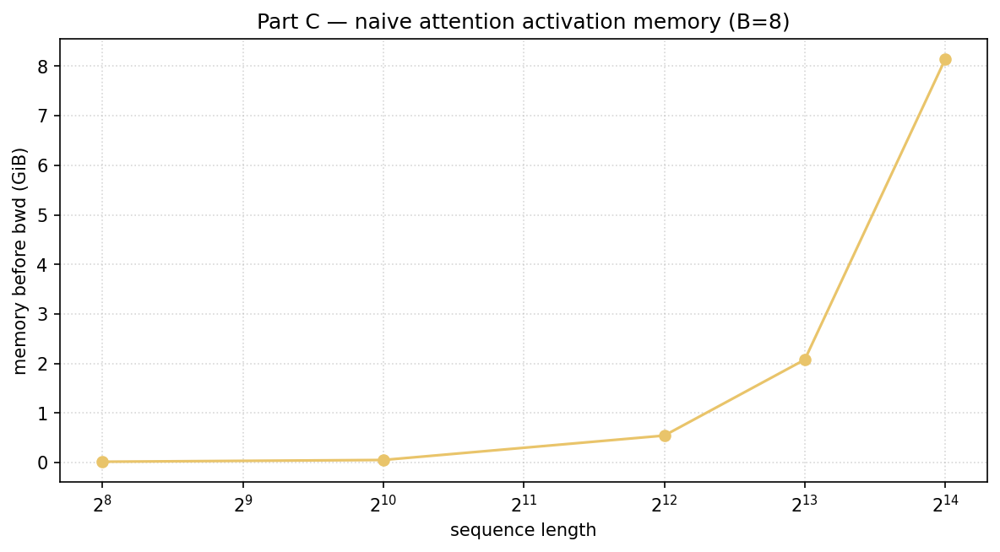

# Part C — FlashAttention / compile

**Raw data:** CSVs below. **Figures:** `figures/*.png` ← use these on GitHub.

## Canonical timing table

**`flash_bench_merged_latest.csv`** — main sweep + Triton `d=128` patch (no shared-mem failures).

| File | Role |
|------|------|
| `attention_bench_latest.csv` | Naive SDPA ± compile |
| `flash_bench_merged_latest.csv` | **Use this** for Flash plots |
| `pytest_flash_*.txt` | Unit-test logs |

## Figures

### Flash vs naive vs educational PyTorch (fp32, d=64)



Log–log: educational `flash_pytorch` grows ~seq²; Triton stays near-flat/ms-scale.

### Triton forward vs head dim (seq=4096)



Includes **d=128** after the tile-size fix.

### Naive attention memory vs sequence (B=8)



## Rebuild figures

```bash
uv run python -m cs336_systems.plot_results
```
