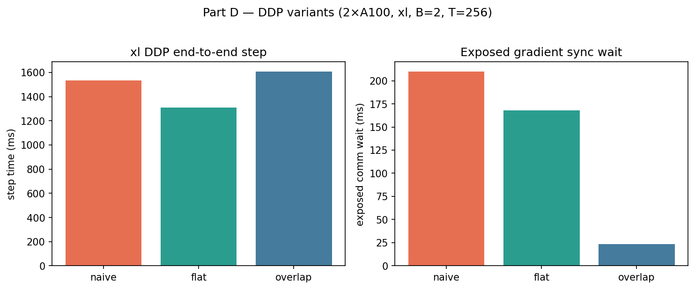
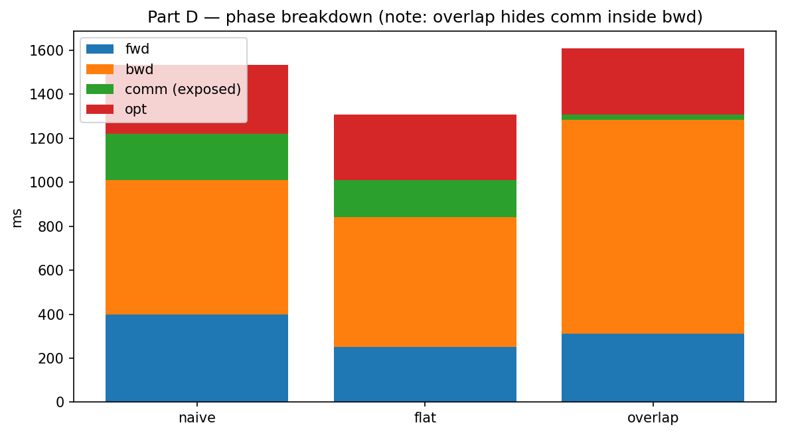
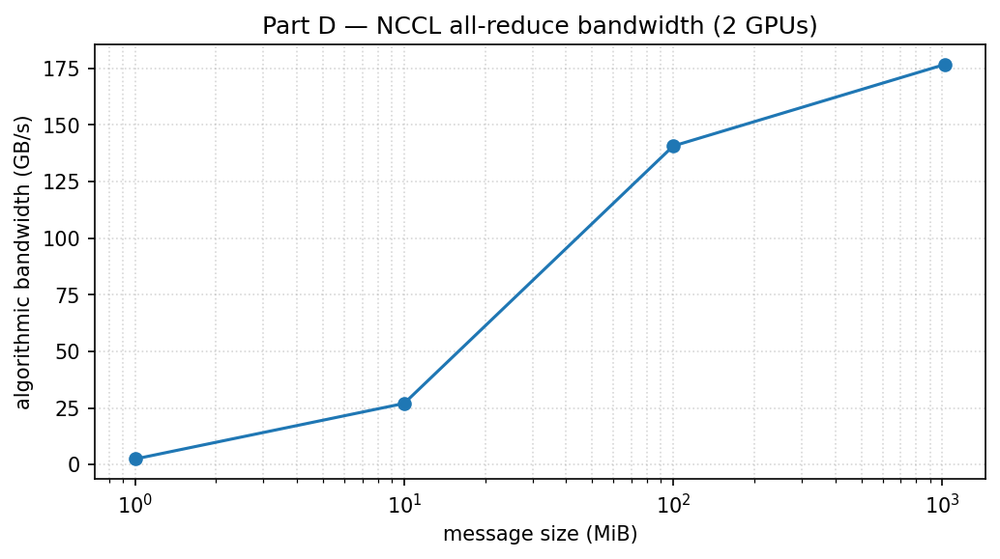

# Part D — Distributed Data Parallel

**Raw data:** `*_latest.csv`. **Figures:** `figures/*.png`.

## Correctness note

On-GPU `pytest` failed (gloo + exclusive CUDA harness). DDP logic passes on CPU; NCCL benches below are valid.

## DDP variants (xl, 2×A100, B=2, T=256)





**Flat** wins end-to-end step time. **Overlap** has tiny *exposed* `comm_ms`, but overlapped NCCL work is counted inside `bwd_ms` after `cuda.synchronize()`.

## All-reduce bandwidth (2 GPUs)



Small messages = latency-bound; ~1 GiB payloads approach link bandwidth (~177 GB/s alg_bw here).

## Rebuild figures

```bash
uv run python -m cs336_systems.plot_results
```
