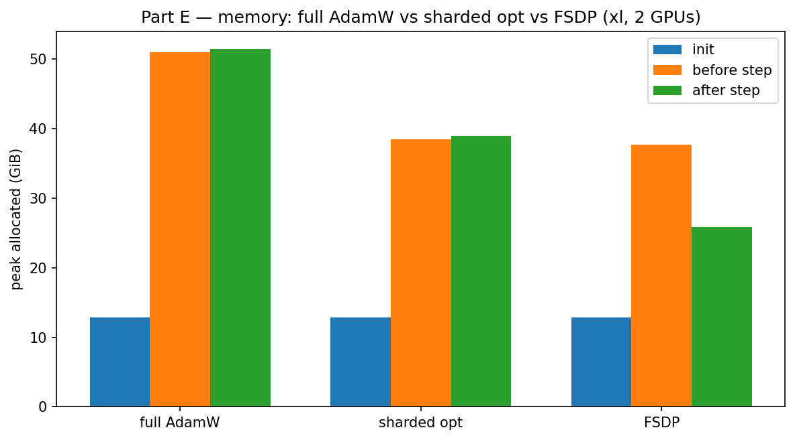
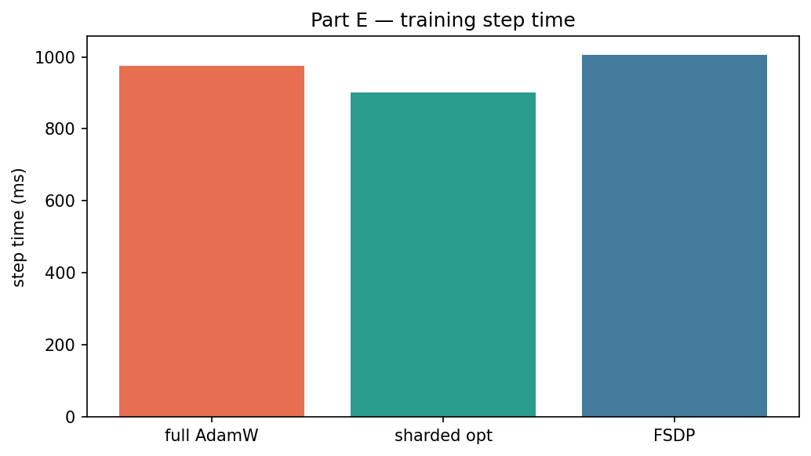

# Part E — Optimizer sharding + FSDP

**Raw data:** `*_latest.csv`. **Figures:** `figures/*.png`.  
Job `1412621` · pytest 6/6 ×2.

## Memory comparison (xl, 2 GPUs)



| setup | after-step peak |
|-------|----------------:|
| full AdamW | ~51 GiB |
| sharded optimizer | ~39 GiB |
| FSDP | ~26 GiB |

## Step time



Sharding optimizer state cuts HBM; FSDP also shards weights (all-gather is temporary).

## Rebuild figures

```bash
uv run python -m cs336_systems.plot_results
```
